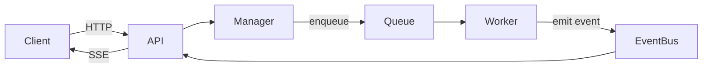

# Update Codemaps

Incrementally update architecture codemaps using git diffs since the last processed commit.

## Step 1: Collect Change Context

Run the helper script to collect all git context in one shot:

```bash
bash ./scripts/collect-diff.sh
```

This script will:
- Extract the last processed commit SHA from `.reports/codemap-diff.txt`
- Check if there are new commits since last run
- Exit early if codemaps are up to date
- Collect commit log and file changes
- Output structured metadata, commits, changed files, and diff stats

If the script exits with "Codemaps are up to date", stop here.

## Step 2: Analyse What Changed

From the diff, identify:
- Files added / removed / renamed
- Interface, type, class, or function signature changes
- New packages, modules, or entry points
- Configuration or environment variable changes
- Container / build tooling topology changes
- New external dependencies
- Test infrastructure changes (new containers, helpers, suite structure, gotchas)

## Step 3: Update Codemaps

Read only the codemaps affected by the identified changes and apply targeted edits — change only the sections that reflect the diff. Do not rewrite unaffected sections. Keep each codemap under 1000 tokens.

| Codemap | Update when… | Owns (do not duplicate elsewhere) |
|---------|-------------|----------------------------------|
| `docs/CODEMAPS/architecture.md` | interfaces or contracts change, new components added, data/event flow changes | System overview, topology diagrams, data/event flows, shared abstractions in prose — no code blocks |
| `docs/CODEMAPS/backend.md` | source files, packages, or API routes added/removed/changed | Package roles, API routes, backend type/interface signatures and code blocks, component notes |
| `docs/CODEMAPS/frontend.md` | UI templates, client-side logic, or component structure changes | Stack, templates/views, client-side event flows, component structure, frontend type/interface signatures |
| `docs/CODEMAPS/dependencies.md` | dependency manifest, env vars, container topology, or build targets change | External dependencies, env vars, build/make targets, service topology |
| `docs/CODEMAPS/testing.md` | test infrastructure, helpers, commands, or test-specific behaviour changes | Test commands, test structure, infrastructure setup, test helpers, gotchas |

---

### `architecture.md` — "How does the system fit together?"

Answers structural, component-level questions. Create if absent.

1. **System overview** — one paragraph or bullet list: what the system does and how the major components relate
2. **Process/service topology** — table of processes or services with their role, port, and transport (what talks to what, and how)
3. **Data and event flows** — For linear flows, use compact chain notation (`A →|endpoint| B → C`); use Mermaid only when there is branching or fan-out. One diagram or chain per distinct flow.
4. **Shared interfaces and contracts** — the key abstractions that decouple components; include sentinel errors and their HTTP/status mappings
5. **Design Invariants** — cross-cutting rules that span multiple components; keep as a `## Design Invariants` section using the format in the Inline Rationale section below

Skip file paths, function signatures, and full interface/type code blocks — those belong in `backend.md`. Describe shared abstractions in prose only.

---

### `backend.md` — "Where does the code live and what does it do?"

Answers source-level questions. Create if absent.

1. **Package/module roles** — table of package path → one-line role (what it owns, not how it works internally)
2. **API routes** — method, path, handler name, one-line description; note which process owns each route when multiple processes exist
3. **Key type and interface signatures** — the actual signatures (not paraphrases) for interfaces, constructors, and entry points an agent would call or implement. For concrete types that implement an interface, list only the constructor — do not repeat the interface's method signatures.
4. **Component-specific notes** — Express as `⚠` annotations on the relevant package-table or route-table row. Create a named section only when there are 3+ non-obvious facts that cannot fit inline.

Skip env vars and build targets — those belong in `dependencies.md`. Skip flow diagrams — those belong in `architecture.md`. Add `⚠` annotations inline for active constraints (see Inline Rationale Annotations below).

---

### `frontend.md` — "How does the UI work?"

Answers stack, template, and client-side behaviour questions. Create if absent.

1. **Stack** — frameworks, libraries, and rendering approach (SSR, SPA, HTMX, etc.)
2. **Templates and views** — inventory of templates or pages with their route/trigger and purpose
3. **Client-side event and data flow** — how the client receives updates (SSE, WebSocket, polling); one table row per event type with payload fields and DOM/state effects
4. **Component/DOM structure** — the key structural elements an agent needs to add a new UI feature or extend an existing one
5. **Client-side functions** — table of functions with a one-line description; note any lifecycle or ordering requirements
6. **Config and build file inventories** — For files following a regular naming convention, state the convention in one line and list only exceptions and entries with non-standard outputs or `⚠` constraints.

Skip backend route logic — that belongs in `backend.md`.

---

### `dependencies.md` — "What does this system depend on and how is it run?"

Answers configuration, infrastructure, and build questions. Create if absent.

1. **External dependencies** — table of library/package, version, and why it exists; skip transitive or self-explanatory entries
2. **Environment variables** — table of name, default, scope (which component reads it), and purpose
3. **Container/service topology** — per-deployment-unit breakdown of services, images, ports, health checks, and startup ordering
4. **Build and run targets** — the Make/npm/cargo/etc. targets an agent would use, and what each does

---

### `testing.md` — "How do I write and run tests correctly?"

Create this file if it does not exist. Capture only what an agent needs to write a correct test without reading the test files first.

1. **Test commands** — each test target (Make/npm/cargo/etc.), what it runs, and what it covers (unit / integration / e2e / load)
2. **Test structure** — how tests are organised (co-located vs. separate directory, naming conventions), and what suites or subtests exist
3. **Test infrastructure** — external services, containers, in-process stubs, or fixtures the tests spin up; note which test types require them and how they are started
4. **Key helpers and utilities** — shared test functions or fixtures with their signatures; note any ordering requirements, side effects, or ownership rules
5. **Non-obvious gotchas** — timing constraints, readiness/warmup patterns, concurrency limits, state that leaks between tests, anything that causes intermittent failures

Prefer a table for commands and helpers. Use prose only for gotchas where a sentence of context prevents misuse. Skip anything obvious from the test framework itself.

---

### Inline Rationale Annotations

When a change introduces a non-obvious constraint — something that looks like it could be simplified or removed but must not be — add a `⚠` annotation inline in the relevant codemap section, adjacent to the fact it constrains. Do **not** create a separate rationale file.

Format: append `⚠ <one sentence: what breaks if you undo this>` to the affected row, bullet, or signature.

```markdown
<!-- In a route table -->
| POST | /tasks | Custom handler — ⚠ must not use shared router; caller pre-creates the resource ID |

<!-- In a package/module note -->
| `infra/broker.conf` | Required config — ⚠ broker 2.x+ silently disables persistence without it |

<!-- Inline with a type or function -->
// Emit always republishes to event bus — ⚠ without this, SSE arrives before the DB write
```

Only annotate **active constraints** — traps that cause bugs if violated. Skip historical context, naming rationale, and routine trade-offs.

### Design Invariants (cross-cutting decisions)

When a change encodes a rule that spans multiple components or codemaps, add or update a `## Design Invariants` section in `docs/CODEMAPS/architecture.md`. Each invariant is one bullet:

```markdown
## Design Invariants

- **<principle>** — <why it exists>. ⚠ <what breaks if violated>.
- **<principle>** — <why it exists>.
```

Use this only for decisions that don't belong to a single file, route, or package — e.g., layering rules, event ordering guarantees, process-boundary contracts.

## Step 3.5: Validate

After updating codemaps, run both validators. Both must pass before finalising.

**Diagram validation:**
```bash
bash ./scripts/validate-mermaid.sh
```
- If `mmdc` / `npx` is not available, the script warns and exits cleanly — do not block on this
- If any diagram fails, fix it and re-run before proceeding

**Budget validation:**
```bash
bash ./scripts/validate-budget.sh
```
- Limit: 6000 chars (~1500 tokens) per file — applies equally to top-level codemaps and `details/` files
- Files at 80–100% of limit are flagged as warnings — no action required, but note the pressure
- If any file is **over budget**, first decide: compress or externalize?

  **Compress** when content is redundant, verbose, or belongs in another codemap:
  1. Replace repeated similar entries with a canonical example + one-liner diffs
  2. Move prose that belongs in another codemap (check the "Skip" rules above)
  3. Convert verbose prose sections to Mermaid diagrams where structure or flow is involved
  4. Tighten verbose sentences to their essential clause

  **Externalize** when content is genuinely detailed but only needed for a specific task type:
  1. Create `docs/CODEMAPS/details/<codemap>-<topic>.md` (e.g. `backend-p04-wiring.md`)
  2. Start the file with a `<!-- Load when: <condition> -->` comment on line 1
  3. Move the detailed content into the new file
  4. Replace the removed content in the parent with a one-line summary and a link in a `## Detailed References` table (see format below)
  5. Re-run validate-budget to confirm both files are within the 6000 char limit

  - Never remove ⚠ annotations or type/function signatures — externalize them instead of deleting

Do **not** call `finalize.sh` if either validator fails — the next run will reprocess the same commits.

### `## Detailed References` table format

When a detail file is created, add or update this section in the **parent** codemap:

```markdown
## Detailed References

| File | Load when… |
|------|-----------|
| [details/backend-p04-wiring.md](./details/backend-p04-wiring.md) | Working on P4 gRPC wiring or dual-listener setup |
```

The "Load when…" condition must be specific enough that an agent can decide without reading the file first.

## Step 4: Finalise

Once all codemap edits are complete and validation passes, run:

```bash
bash ./scripts/finalize.sh
```

This writes `.reports/codemap-diff.txt` with the correct HEAD SHA and commit range. Only call this after analysis succeeds — if anything failed, skip it so the next run reprocesses the same commits.

## Topology Diagrams

Use compact Mermaid for process topology and data-flow diagrams. Prefer it over ASCII when there is branching, fan-out, or bidirectional flow; use a plain one-liner (`A → B → C`) for simple linear paths.

### Rules (strict subset — optimise for token density)

- **`flowchart LR` only** — do not use sequence, C4, or other diagram types
- **No styling** — no `classDef`, no `style`, no colors
- **No subgraphs** unless the grouping itself carries meaning (e.g. a process boundary)
- **Abbreviate node IDs** — use short IDs with a display label only when the ID alone is unclear: `Q[TaskQueue]`
- **Omit display labels when the ID is self-explanatory** — `API --> Manager`, not `API[API] --> Manager[Manager]`
- **Label edges only for transport or protocol** — `API -->|POST /tasks| Manager`; omit labels for obvious delegation
- **One diagram per component or layer** — do not combine unrelated flows; keep each under 15 nodes

### Example



### When to use a table instead

Prefer a Markdown table over a diagram for:
- Package or file listings
- API route inventories
- Environment variable references
- Anything that is a lookup, not a flow

## Tips

- Focus on **high-level structure**, not implementation details
- Prefer **file paths and function signatures** over full code blocks
- Keep each codemap under **4000 chars (~1000 tokens)** for efficient context loading
- Run after major feature additions or refactoring sessions
- **No Status columns** — never add implementation-progress columns (✓, 🔨, TODO) to tables; if incompleteness affects how to call or implement something, add a `⚠` on that row only
- **Fragment cells** — table cells should be noun phrases or fragments (≤10 words); move constraints to `⚠` annotations rather than embedding them in the description cell
- **Prefer chain notation over prose for linear flows** — `A →|endpoint| B → C` replaces a numbered list; use Mermaid only when there is branching or fan-out
