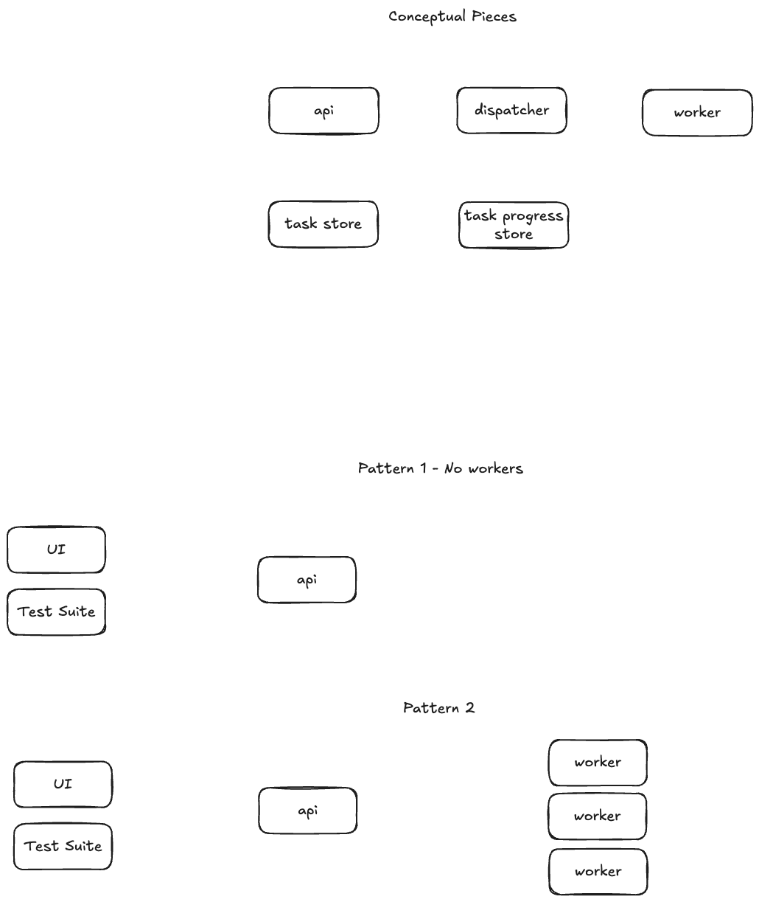

# Work Distribution Patterns

A Go demo exploring three work-dispatching patterns with progressively increasing scalability.



## Patterns

| Pattern | Topology | Use When |
|---|---|---|
| **1 — Goroutine Pool** | Single process | Low traffic, simple ops |
| **2 — WebSocket Hub** | 1 API + N workers | Moderate traffic, external workers |
| **3 — NATS JetStream** | N APIs + N workers + NATS | High traffic, full distribution |

All three expose an **identical HTTP API** and **identical HTMX frontend**. Only the dispatch mechanism changes.

## Quick Start

### Pattern 1 — Goroutine Pool (no Docker needed)

```bash
make run-p1
# open http://localhost:8080
```

```bash
# Submit a task via curl
curl -X POST localhost:8080/tasks \
  -H "Content-Type: application/json" \
  -d '{"name":"hello","stage_count":3}'

# Stream SSE events
curl -N localhost:8080/events
```

### Pattern 2 — WebSocket Worker Hub

```bash
make run-p2
# 1 API + 3 worker replicas
# open http://localhost:8080
```

### Pattern 3 — NATS JetStream

```bash
make run-p3
# 3 API replicas + 3 workers + NATS + nginx
# open http://localhost:8080
# NATS monitoring: http://localhost:8222
```

## Architecture

```
Browser
  │  HTTP POST /tasks, GET /tasks, GET /tasks/{id}
  │  SSE  GET /events
  ▼
┌─────────────────────────────────────────────────────┐
│  shared/api  (HTTP handlers + SSE — 100% shared)    │
│  POST /tasks → manager.Submit(task)                 │
│  GET  /events → sse.Hub.Subscribe()                 │
└──────────────────┬──────────────────────────────────┘
                   │ contracts.TaskDispatcher interface
        ┌──────────┴─────────────────────────┐
        │                                    │
  Pattern 1                          Pattern 2 / 3 / 4
  ChannelDispatcher              REST/WS/NATSDispatcher
  (in-process)                (routes to external workers)
```

Progress always terminates at `sse.Hub.Publish()` — the SSE layer never changes.

## API Contract

```
POST /tasks          {"name", "stage_count" (1-8, default 3)}
                     → 202 {"id":"..."}
GET  /tasks          → []Task
GET  /tasks/{id}     → Task
GET  /events         SSE stream
GET  /               HTMX frontend
```

SSE event types:
```json
{"type":"stage_progress","taskID":"...","stageIdx":2,"stageName":"Validation","progress":67,"status":"running"}
{"type":"task_status","taskID":"...","status":"completed"}
```

## Testing

```bash
# E2E tests (requires a running server)
BASE_URL=http://localhost:8080 make test-e2e

# Load test
BASE_URL=http://localhost:8080 make test-load

# Build all binaries
make build-all
```

## Project Structure

```
shared/
├── models/       Task, Stage, ProgressEvent data types
├── contracts/    Interfaces (TaskDispatcher, TaskWorker, TaskManager)
├── sse/          SSE hub — broadcaster to all browser connections
├── executor/     Stage runner
├── store/        TaskStore interface + MemoryStore
├── api/          All HTTP handlers (shared across all patterns)
└── templates/    Single embedded HTMX frontend

patterns/
├── 01-goroutine-pool/    Bounded goroutine pool (in-process)
├── 02-rest-polling/      REST-based worker polling
├── 03-websocket-hub/     WebSocket dispatch to external workers
└── 04-queue-and-store/   NATS JetStream (queue) + PostgreSQL (store)
```

## Environment Variables

<!-- AUTO-GENERATED from patterns/*/cmd/*/main.go -->

### Pattern 1 — Goroutine Pool (`patterns/01-goroutine-pool/cmd/server`)

| Variable | Default | Description |
|---|---|---|
| `ADDR` | `:8080` | Listen address |
| `WORKERS` | `5` | Goroutine pool size |
| `QUEUE_SIZE` | `20` | Max queued tasks before HTTP 429 |
| `STAGE_DURATION_SECS` | `3` | Seconds per stage |

### Pattern 2 — WebSocket Hub

API (`patterns/02-websocket-hub/cmd/api`):

| Variable | Default | Description |
|---|---|---|
| `ADDR` | `:8080` | Listen address |

Worker (`patterns/02-websocket-hub/cmd/worker`):

| Variable | Default | Description |
|---|---|---|
| `API_URL` | `ws://localhost:8080/ws/register` | API WebSocket endpoint |
| `STAGE_DURATION_SECS` | `3` | Seconds per stage |

### Pattern 3 — NATS JetStream

API (`patterns/03-queue-and-store/cmd/api`):

| Variable | Default | Description |
|---|---|---|
| `ADDR` | `:8080` | Listen address |
| `NATS_URL` | `nats://127.0.0.1:4222` | NATS server URL |

Worker (`patterns/03-queue-and-store/cmd/worker`):

| Variable | Default | Description |
|---|---|---|
| `NATS_URL` | `nats://127.0.0.1:4222` | NATS server URL |
| `STAGE_DURATION_SECS` | `3` | Seconds per stage |

<!-- END AUTO-GENERATED -->

## Key Design Decisions

- **`contracts.TaskDispatcher`** is the only seam between HTTP and execution — `shared/api` never imports pattern-specific code.
- **Stage duration** is controlled by the `MAX_STAGE_DURATION` environment variable on each server/worker process — it is not part of the task payload.
- **`TaskConsumer`** satisfies the event reporting needs of the executor, providing a single view from the worker side.
- **Pattern 4** has all API replicas subscribe to NATS Core progress subjects, so any replica can serve any SSE client — no sticky sessions.
