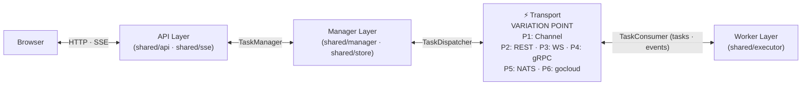
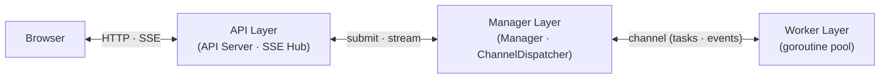
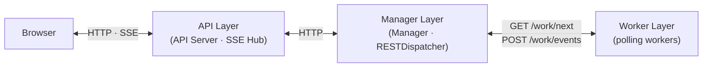
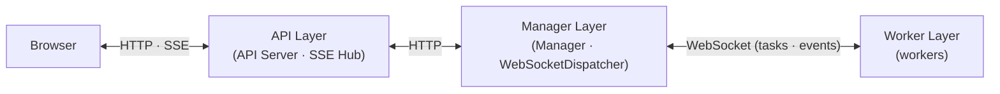
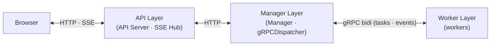
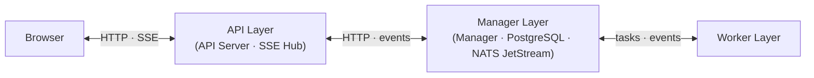
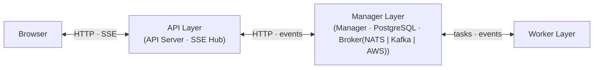

<div align="center">
  <a href="https://github.com/deyarchit/work-distribution-patterns/actions/workflows/go-test.yml"></a>
  <a href="https://github.com/deyarchit/work-distribution-patterns/actions/workflows/golangci-lint.yml"></a>
  <a href="https://codecov.io/gh/deyarchit/work-distribution-patterns"></a>
</div>


# Work Distribution Patterns

A project exploring various work-distribution patterns with progressively increasing scalability and decoupling.

## Layered Architecture Overview

All patterns share the same HTTP API and Manager, with **one variation point**: the **Transport Layer** (`contracts.TaskDispatcher` / `contracts.TaskConsumer`).



## Patterns

| Pattern | Topology | Communication Style | Full-Stack Layering |
|---|---|---|---|
| **p01: Local-Channels** | Single process | In-process channels | Embedded Monolith |
| **p02: Pull-REST** | 1 API + N workers | HTTP Long-polling | Tiered Remote Polling |
| **p03: Push-WebSocket** | 1 API + N workers | Persistent WebSockets | Tiered Remote Push |
| **p04: Streaming-gRPC** | 1 API + N workers | gRPC Bidirectional Streams | Tiered Remote Streaming |
| **p05: Brokered-NATS** | N APIs + N workers | NATS + PostgreSQL | Distributed Event-Driven |
| **p06: Cloud-PubSub** | N APIs + N workers | gocloud.dev (NATS/Kafka/AWS) | Multi-Cloud Event-Driven |

All patterns expose an **identical HTTP API** and **identical HTMX frontend**. Only the internal dispatch mechanism and layering changes.

## Pattern Diagrams

### P1: Local-Channels (Single Process)
**Single process:** API, Manager, and Workers run as goroutines in one process.



### P2: Pull-REST (REST Polling)
**Separate processes:** API and Manager on different ports. Workers poll Manager for tasks.



### P3: Push-WebSocket (WebSocket Hub)
**Separate processes with persistent connections:** Manager owns WebSocket hub, pushes tasks to workers.



### P4: Streaming-gRPC (gRPC Bidirectional)
**Separate processes with bidirectional streams:** Manager runs dual listeners (HTTP + gRPC) for high-performance streaming.



### P5: Brokered-NATS (Distributed Event-Driven)
**Horizontally scaled:** Multiple API replicas, NATS JetStream for queuing, PostgreSQL for durability.



### P6: Cloud-PubSub (Multi-Cloud Event-Driven)
**Cloud-agnostic abstraction:** Broker-agnostic via gocloud.dev (NATS/Kafka/AWS SNS-SQS), same distributed topology as P5.



## Prerequisites

### Runtime Dependencies (Required)

All patterns require:
- **Go 1.25+**
- **Docker** and **Docker Compose** (for patterns 2-6)

> **Note:** Pattern 4 uses gRPC, but the generated protobuf code is **already checked into the repository** (`patterns/p04/proto/*.pb.go`). You do **not** need to install protoc or any code generators unless you plan to modify the `.proto` file itself.

### Development Dependencies (Optional)

**Only needed if modifying `patterns/p04/proto/work.proto`:**

- **protoc** (Protocol Buffers compiler)
- **protoc-gen-go** (Go protobuf code generator)
- **protoc-gen-go-grpc** (Go gRPC code generator)

#### Installing Protobuf Toolchain (Development Only)

**On macOS (via Homebrew):**
```bash
brew install protobuf
go install google.golang.org/protobuf/cmd/protoc-gen-go@latest
go install google.golang.org/grpc/cmd/protoc-gen-go-grpc@latest
```

**Verify Installation:**
```bash
protoc --version        # Should show libprotoc 3.x or higher
which protoc-gen-go     # Should be in $GOPATH/bin or ~/go/bin
which protoc-gen-go-grpc
```

**Note:** Ensure `$GOPATH/bin` (or `~/go/bin`) is in your `$PATH`:
```bash
export PATH="$PATH:$(go env GOPATH)/bin"
```

#### Regenerating Protobuf Code

After modifying `patterns/p04/proto/work.proto`:
```bash
make gen-proto
```

## Quick Start

### Pattern 1: Local-Channels (no Docker needed)

```bash
make run-p1
# open http://localhost:8080
```

### Pattern 2: Pull-REST (Docker)

```bash
make run-p2
# open http://localhost:8080
```

### Pattern 3: Push-WebSocket (Docker)

```bash
make run-p3
# open http://localhost:8080
```

### Pattern 4: Streaming-gRPC (Docker)

```bash
make run-p4
# open http://localhost:8080
```

### Pattern 5: Brokered-NATS (Docker)

```bash
make run-p5
# open http://localhost:8080
```

### Pattern 6: Cloud-PubSub (Docker)

Uses `gocloud.dev/pubsub` abstraction. Supports three brokers:

```bash
# NATS JetStream (default)
make run-p6 BROKER=nats

# Kafka
make run-p6 BROKER=kafka

# AWS SNS/SQS (via LocalStack)
make run-p6 BROKER=aws

# open http://localhost:8080
```

## Testing

```bash
# E2E tests (requires a running server)
BASE_URL=http://localhost:8080 make test-e2e

# Load test
BASE_URL=http://localhost:8080 make test-load

# Build all binaries
make build-all

# Run all patterns end-to-end
make test-all
```

## Project Structure

```
shared/
├── api/          All HTTP handlers (shared across all patterns)
├── manager/      Unified task lifecycle management
├── contracts/    Interfaces (TaskDispatcher, TaskConsumer, TaskManager)
├── models/       Task, Stage, TaskEvent data types
├── executor/     Stage runner (worker-side logic)
├── store/        Persistence (Memory, PostgreSQL)
├── events/       Event Bus (Memory, NATS)
├── client/       Remote proxy for API-to-Manager communication
├── sse/          SSE hub — broadcaster to browser connections
└── templates/    Embedded HTMX frontend

patterns/
├── p01/          Local-Channels: Bounded goroutine pool (in-process)
├── p02/          Pull-REST: REST-based worker polling
├── p03/          Push-WebSocket: WebSocket dispatch to external workers
├── p04/          Streaming-gRPC: gRPC bidirectional streams with protobuf
├── p05/          Brokered-NATS: NATS JetStream (queue) + PostgreSQL (store)
└── p06/          Cloud-PubSub: gocloud.dev abstraction (NATS/Kafka/AWS)
```
