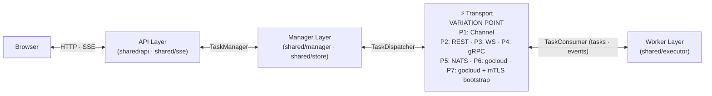
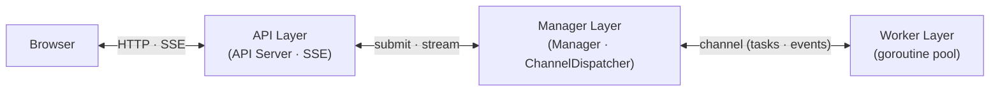
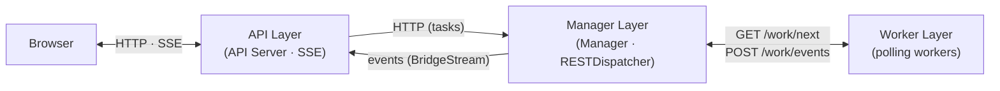
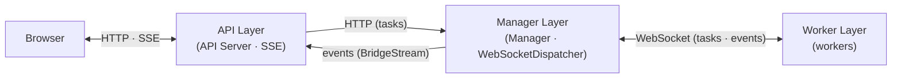
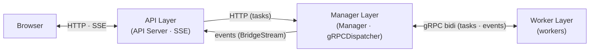
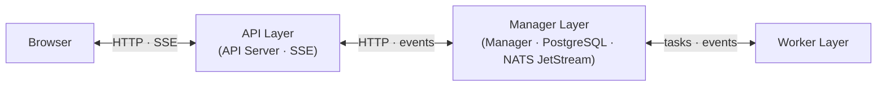
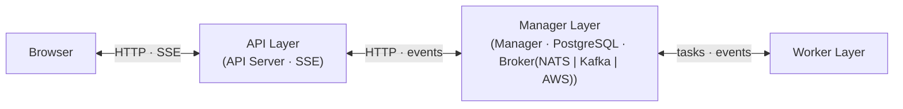
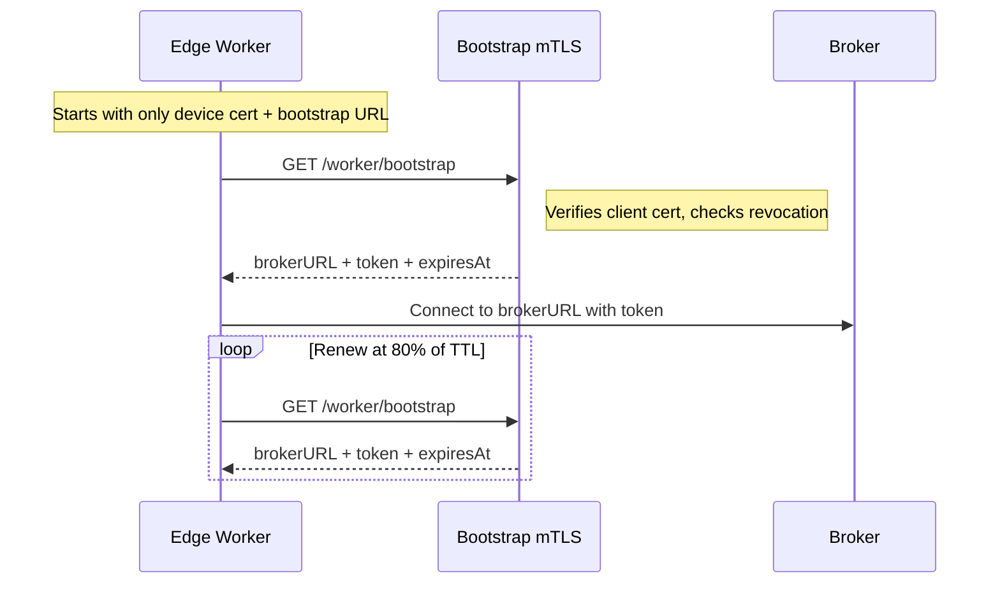
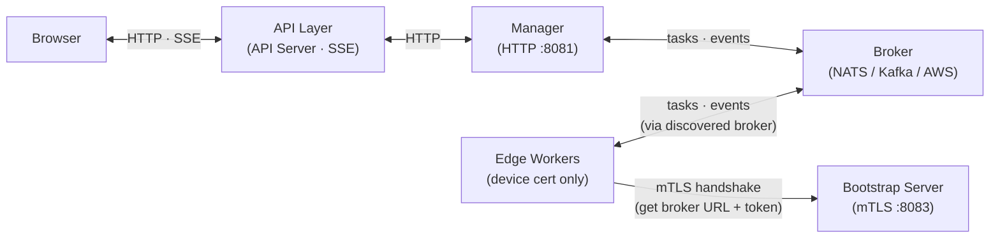

<div align="center">
  <a href="https://github.com/deyarchit/work-distribution-patterns/actions/workflows/go-test.yml"></a>
  <a href="https://github.com/deyarchit/work-distribution-patterns/actions/workflows/golangci-lint.yml"></a>
  <a href="https://codecov.io/gh/deyarchit/work-distribution-patterns"></a>
</div>


# Work Distribution Patterns

A project exploring various work-distribution patterns with progressively increasing scalability and decoupling.

## Layered Architecture Overview

All patterns share the same HTTP API and Manager, with **one variation point**: the **Transport Layer** (`contracts.TaskDispatcher` / `contracts.TaskConsumer`). P7 adds a second variation: **how workers discover their runtime configuration**.


```mermaid
graph LR
    Browser["Browser"]
    API["API Layer<br/>(shared/api · shared/sse)"]
    Manager["Manager Layer<br/>(shared/manager · shared/store)"]
    Transport["⚡ Transport<br/>VARIATION POINT<br/>P1: Channel<br/>P2: REST · P3: WS · P4: gRPC<br/>P5: NATS · P6: gocloud · P7: gocloud + mTLS bootstrap"]
    Workers["Worker Layer<br/>(shared/executor)"]

    Browser <-->|"HTTP · SSE"| API
    API <-->|"TaskManager"| Manager
    Manager <-->|"TaskDispatcher"| Transport
    Transport <-->|"TaskConsumer (tasks · events)"| Workers
```

## Design Principles

Three invariant layers with fixed responsibilities. Only the transport between Manager and Worker varies across patterns.

| Layer | Responsibility |
|---|---|
| **API** | Accepts tasks from the client. Submits to the Manager synchronously — only returns success after the Manager acknowledges. Streams progress via a **user-scoped SSE connection** (one `EventSource` per browser session, routed by user ID; demuxed by task ID on the client). Surfaces task status as reported by the Manager. |
| **Manager** | Stores task state. Dispatches tasks to workers (fire-and-forget — no pickup guarantee). Receives progress and results from workers. Enriches events with the submitting user's ID, then republishes to the API layer. |
| **Worker** | Executes tasks. Emits progress events and final status back to the Manager. Nothing else. |

**Invariants that hold across all patterns:**
- The client never talks to the Manager or Worker directly — only to the API.
- The API submit is synchronous: the Manager must acknowledge before the API responds to the client.
- The Manager does not wait for a worker to pick up a task. Dispatch is fire-and-forget.
- The Manager always republishes worker events before the API layer delivers them to the client (ensures state is consistent before SSE reaches the browser).
- User identity flows from the client: a UUID cookie (minted on first visit) for browsers, or an `X-User-ID` header for API clients. The Manager stamps this ID onto every outbound event so the SSE layer can route to the correct subscriber.

## Patterns

All patterns expose an **identical HTTP API** and **identical HTMX frontend**. The table below shows where each pattern follows the invariants and where the transport varies.

| Pattern | Topology | Client ↔ API | API ↔ Manager | Manager → Worker (⚡ varies) | Worker → Manager (⚡ varies) | Manager → API (events) |
|---|---|---|---|---|---|---|
| **p01: Local-Channels** | Single process | HTTP · SSE | In-process call | Buffered channel | `MemoryBridge` publish | `MemoryBridge` subscribe |
| **p02: Pull-REST** | 1 API + 1 Manager + N workers | HTTP · SSE | HTTP (`RemoteTaskManager`) | Worker polls `GET /work/next` | `POST /work/events` | API subscribes to Manager `GET /events` (`BridgeStream` → `MemoryBridge`) |
| **p03: Push-WebSocket** | 1 API + 1 Manager + N workers | HTTP · SSE | HTTP (`RemoteTaskManager`) | WebSocket push to idle worker | WebSocket emit | API subscribes to Manager `GET /events` (`BridgeStream` → `MemoryBridge`) |
| **p04: Streaming-gRPC** | 1 API + 1 Manager + N workers | HTTP · SSE | HTTP (`RemoteTaskManager`) | gRPC bidirectional stream | gRPC bidirectional stream | API subscribes to Manager `GET /events` (`BridgeStream` → `MemoryBridge`) |
| **p05: Brokered-NATS** | N APIs + N managers + N workers | HTTP · SSE | HTTP (`RemoteTaskManager`) | NATS JetStream `tasks.new` | NATS `worker.events.*` (queue group) | `NATSBridge` (fan-out to all APIs) |
| **p06: Cloud-PubSub** | N APIs + N managers + N workers | HTTP · SSE | HTTP (`RemoteTaskManager`) | gocloud pubsub TASKS topic | gocloud pubsub EVENTS topic | `CloudBridge` (fan-out to all APIs) |
| **p07: Bootstrap-mTLS** | N APIs + N managers (HTTP + mTLS) + N edge workers | HTTP · SSE | HTTP (`RemoteTaskManager`) | gocloud pubsub TASKS topic (URL discovered at runtime) | gocloud pubsub EVENTS topic | `CloudBridge` (fan-out to all APIs) |

## Pattern Diagrams

### P1: Local-Channels (Single Process)
**Single process:** API, Manager, and Workers run as goroutines in one process.


```mermaid
graph LR
    Browser["Browser"]
    API["API Layer<br/>(API Server · SSE)"]
    Manager["Manager Layer<br/>(Manager · ChannelDispatcher)"]
    Workers["Worker Layer<br/>(goroutine pool)"]

    Browser <-->|"HTTP · SSE"| API
    API <-->|"submit · stream"| Manager
    Manager <-->|"channel (tasks · events)"| Workers
```

### P2: Pull-REST (REST Polling)
**Separate processes:** API and Manager on different ports. Workers poll Manager for tasks. API subscribes to Manager's `BridgeStream` endpoint for event relay.


```mermaid
graph LR
    Browser["Browser"]
    API["API Layer<br/>(API Server · SSE)"]
    Manager["Manager Layer<br/>(Manager · RESTDispatcher)"]
    Workers["Worker Layer<br/>(polling workers)"]

    Browser <-->|"HTTP · SSE"| API
    API -->|"HTTP (tasks)"| Manager
    Manager -->|"events (BridgeStream)"| API
    Manager <-->|"GET /work/next<br/>POST /work/events"| Workers
```

### P3: Push-WebSocket (WebSocket Hub)
**Separate processes with persistent connections:** Manager owns WebSocket hub, pushes tasks to workers. API subscribes to Manager's `BridgeStream` endpoint for event relay.


```mermaid
graph LR
    Browser["Browser"]
    API["API Layer<br/>(API Server · SSE)"]
    Manager["Manager Layer<br/>(Manager · WebSocketDispatcher)"]
    Workers["Worker Layer<br/>(workers)"]

    Browser <-->|"HTTP · SSE"| API
    API -->|"HTTP (tasks)"| Manager
    Manager -->|"events (BridgeStream)"| API
    Manager <-->|"WebSocket (tasks · events)"| Workers
```

### P4: Streaming-gRPC (gRPC Bidirectional)
**Separate processes with bidirectional streams:** Manager runs dual listeners (HTTP + gRPC) for high-performance streaming. API subscribes to Manager's `BridgeStream` endpoint for event relay.


```mermaid
graph LR
    Browser["Browser"]
    API["API Layer<br/>(API Server · SSE)"]
    Manager["Manager Layer<br/>(Manager · gRPCDispatcher)"]
    Workers["Worker Layer<br/>(workers)"]

    Browser <-->|"HTTP · SSE"| API
    API -->|"HTTP (tasks)"| Manager
    Manager -->|"events (BridgeStream)"| API
    Manager <-->|"gRPC bidi (tasks · events)"| Workers
```

### P5: Brokered-NATS (Distributed Event-Driven)
**Horizontally scaled:** Multiple API, Manager, and Worker replicas. NATS JetStream for queuing (work-queue policy ensures each task goes to one worker; queue group ensures each event goes to one manager). PostgreSQL for durability.


```mermaid
graph LR
    Browser["Browser"]
    API["API Layer<br/>(API Server · SSE)"]
    Manager["Manager Layer<br/>(Manager · PostgreSQL · NATS JetStream)"]
    Workers["Worker Layer"]

    Browser <-->|"HTTP · SSE"| API
    API <-->|"HTTP · events"| Manager
    Manager <-->|"tasks · events"| Workers
```

### P6: Cloud-PubSub (Multi-Cloud Event-Driven)
**Cloud-agnostic abstraction:** Same horizontally scaled topology as P5 (N APIs, N managers, N workers). Broker-agnostic via gocloud.dev (NATS/Kafka/AWS SNS-SQS); each broker's native consumer-group/queue semantics ensure each event is processed by exactly one manager.


```mermaid
graph LR
    Browser["Browser"]
    API["API Layer<br/>(API Server · SSE)"]
    Manager["Manager Layer<br/>(Manager · PostgreSQL · <br/>Broker(NATS | Kafka | AWS))"]
    Workers["Worker Layer"]

    Browser <-->|"HTTP · SSE"| API
    API <-->|"HTTP · events"| Manager
    Manager <-->|"tasks · events"| Workers
```

### P7: Bootstrap-mTLS (Edge Worker Discovery)

**Zero-configuration edge workers:** Workers carry only a device certificate and a bootstrap URL. On startup they perform a one-time mTLS handshake to discover the broker address and receive a short-lived token — no broker config is baked into the worker binary or its deployment manifests. The manager can rotate infrastructure (broker URL, credentials) without touching edge workers.

The manager runs two listeners: a plain HTTP server for the internal task API (same as P6), and a separate **mTLS server** that enforces client certificate authentication at the TLS layer before any handler runs.

#### Bootstrap Handshake


```mermaid
sequenceDiagram
    participant W as Edge Worker
    participant B as Bootstrap mTLS
    participant K as Broker

    Note over W: Starts with only device cert + bootstrap URL

    W->>B: GET /worker/bootstrap
    Note right of B: Verifies client cert, checks revocation
    B-->>W: brokerURL + token + expiresAt

    W->>K: Connect to brokerURL with token

    loop Renew at 80% of TTL
        W->>B: GET /worker/bootstrap
        B-->>W: brokerURL + token + expiresAt
    end
```

#### Runtime Topology


```mermaid
graph LR
    Browser["Browser"]
    API["API Layer<br/>(API Server · SSE)"]
    Manager["Manager<br/>(HTTP :8081)"]
    Bootstrap["Bootstrap Server<br/>(mTLS :8083)"]
    Broker["Broker<br/>(NATS / Kafka / AWS)"]
    Workers["Edge Workers<br/>(device cert only)"]

    Browser <-->|"HTTP · SSE"| API
    API <-->|"HTTP"| Manager
    Manager <-->|"tasks · events"| Broker
    Workers -->|"mTLS handshake<br/>(get broker URL + token)"| Bootstrap
    Workers <-->|"tasks · events<br/>(via discovered broker)"| Broker
```

#### Security Properties

| Property | Mechanism |
|---|---|
| **Worker identity** | X.509 client certificate (CN = device ID); verified by TLS before handler runs |
| **Revocation** | Runtime deny-list keyed by CN; 403 returned on next bootstrap |
| **Credential lifetime** | Short-lived HMAC-signed tokens (configurable TTL, default 15 min) |
| **Token renewal** | Worker re-bootstraps at 80% of remaining TTL; no manual intervention |
| **Broker config isolation** | Workers never have static broker credentials; all config flows through bootstrap |

## Prerequisites

### Runtime Dependencies (Required)

All patterns require:
- **Go 1.25+**
- **Docker** and **Docker Compose** (for patterns 2–7)

> **Note:** Pattern 4 uses gRPC, but the generated protobuf code is **already checked into the repository** (`patterns/p04/proto/*.pb.go`). You do **not** need to install protoc or any code generators unless you plan to modify the `.proto` file itself.

### Development Dependencies (Optional)

**Only needed if modifying `patterns/p04/proto/work.proto`:**

- **protoc** (Protocol Buffers compiler)
- **protoc-gen-go** (Go protobuf code generator)
- **protoc-gen-go-grpc** (Go gRPC code generator)

#### Installing Protobuf Toolchain (Development Only)

**On macOS (via Homebrew):**
```bash
brew install protobuf
go install google.golang.org/protobuf/cmd/protoc-gen-go@latest
go install google.golang.org/grpc/cmd/protoc-gen-go-grpc@latest
```

**Verify Installation:**
```bash
protoc --version        # Should show libprotoc 3.x or higher
which protoc-gen-go     # Should be in $GOPATH/bin or ~/go/bin
which protoc-gen-go-grpc
```

**Note:** Ensure `$GOPATH/bin` (or `~/go/bin`) is in your `$PATH`:
```bash
export PATH="$PATH:$(go env GOPATH)/bin"
```

#### Regenerating Protobuf Code

After modifying `patterns/p04/proto/work.proto`:
```bash
make gen-proto
```

## Quick Start

### Pattern 1: Local-Channels (no Docker needed)

```bash
make run-p1
# open http://localhost:8080
```

### Pattern 2: Pull-REST (Docker)

```bash
make run-p2
# open http://localhost:8080
```

### Pattern 3: Push-WebSocket (Docker)

```bash
make run-p3
# open http://localhost:8080
```

### Pattern 4: Streaming-gRPC (Docker)

```bash
make run-p4
# open http://localhost:8080
```

### Pattern 5: Brokered-NATS (Docker)

```bash
make run-p5
# open http://localhost:8080
```

### Pattern 6: Cloud-PubSub (Docker)

Uses `gocloud.dev/pubsub` abstraction. Supports three brokers:

```bash
# NATS JetStream (default)
make run-p6 BROKER=nats

# Kafka
make run-p6 BROKER=kafka

# AWS SNS/SQS (via LocalStack)
make run-p6 BROKER=aws

# open http://localhost:8080
```

### Pattern 7: Bootstrap-mTLS (Docker)

Same horizontally scaled topology as P6 (N APIs, N managers, N workers + nginx), with two additions: each manager replica runs a second **mTLS listener** (`:8083`) for worker bootstrap, and a `certs-init` container generates the CA, server certificate, and worker device certificate at startup.

Supports the same three brokers as P6:

```bash
# NATS JetStream (default)
make run-p7 BROKER=nats

# Kafka
make run-p7 BROKER=kafka

# AWS SNS/SQS (via LocalStack)
make run-p7 BROKER=aws

# open http://localhost:8080
```

The in-process integration test exercises the full bootstrap handshake, revocation, and token renewal with ephemeral PKI (no Docker required):

```bash
go test ./patterns/p07/... -v -run TestP7Integration
```

## Testing

```bash
# E2E tests (requires a running server)
BASE_URL=http://localhost:8080 make test-e2e

# Load test
BASE_URL=http://localhost:8080 make test-load

# Build all binaries
make build-all

# Run all patterns end-to-end
make test-all
```

## Project Structure

```
shared/
├── api/          All HTTP handlers (shared across all patterns)
├── manager/      Unified task lifecycle management
├── contracts/    Interfaces (TaskDispatcher, TaskConsumer, TaskManager)
├── models/       Task, Stage, TaskEvent data types
├── executor/     Stage runner (worker-side logic)
├── store/        Persistence (Memory, PostgreSQL)
├── events/       Event Bus (Memory, NATS)
├── client/       Remote proxy for API-to-Manager communication
├── sse/          SSE hub — broadcaster to browser connections
└── templates/    Embedded HTMX frontend

patterns/
├── p01/          Local-Channels: Bounded goroutine pool (in-process)
├── p02/          Pull-REST: REST-based worker polling
├── p03/          Push-WebSocket: WebSocket dispatch to external workers
├── p04/          Streaming-gRPC: gRPC bidirectional streams with protobuf
├── p05/          Brokered-NATS: NATS JetStream (queue) + PostgreSQL (store)
├── p06/          Cloud-PubSub: gocloud.dev abstraction (NATS/Kafka/AWS)
└── p07/          Bootstrap-mTLS: edge workers discover broker config via mTLS handshake
```
