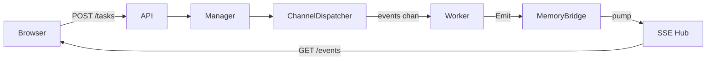
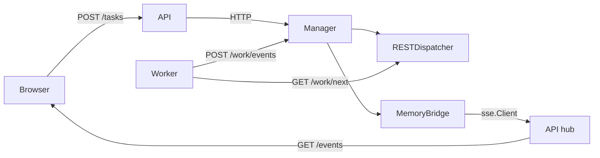
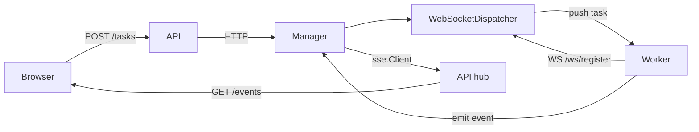
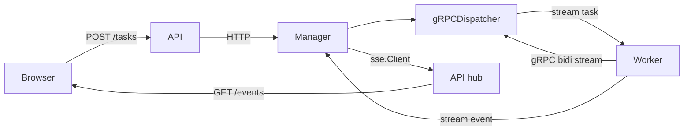
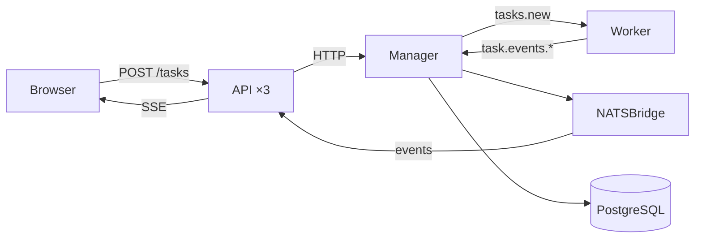
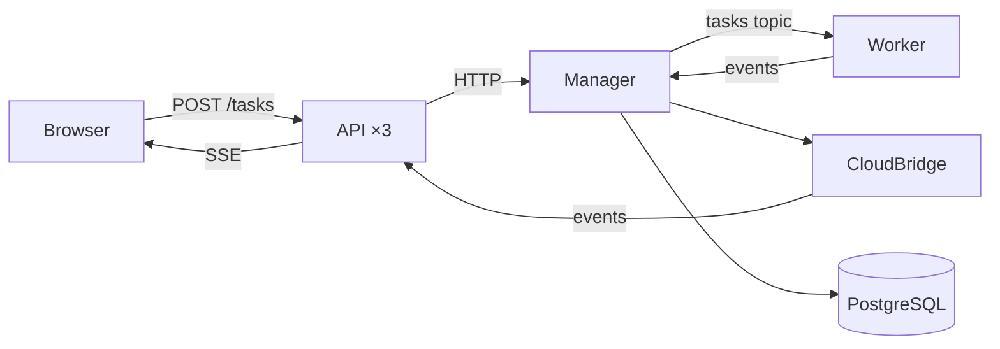

# Architecture

## Overview

Six patterns demonstrating different work distribution topologies, all sharing the same HTTP API surface and HTMX frontend.

## Shared Interfaces

| Interface | Methods | Role |
|-----------|---------|------|
| `contracts.TaskManager` | Submit/Get/List | API → Manager |
| `contracts.TaskDispatcher` | Start/Dispatch/ReceiveEvent | Manager-side transport (⚠ variation point) |
| `contracts.TaskConsumer` | Connect/Receive/Emit | Worker-side transport (⚠ variation point) |
| `events.TaskEventBridge` | Publish/Subscribe | Event streaming |
| `store.TaskStore` | Create/Get/List/SetStatus | Persistence |

- `RemoteTaskManager`: HTTP proxy for Submit/Get/List (P2–P6 APIs)
- Errors: `ErrDispatchFull` → 429, `ErrNoWorkers` → 503

## Design Invariants

- **Manager republishes events** — ⚠ skipping breaks P5/P6 (SSE arrives before DB write).
- **API uses `TaskManager` abstraction** — ⚠ never access store directly; manager-local in P2–P6.
- **Tests: `WaitForWorker` waits for completion** — ⚠ ensures worker idle before suite (P3/P4).

## Process Topology

| Pattern | API | Manager | Worker | Transport |
|---------|-----|---------|--------|-----------|
| P1 | single process | same | goroutines | in-process channels |
| P2 | :8080 | :8081 | separate process | REST polling |
| P3 | :8080 | :8081 | separate process | WebSocket push |
| P4 | :8080 | :8081 | separate process | gRPC bidirectional stream |
| P5 | :8080 (×3) | :8081 (×1) | separate process (×3) | NATS JetStream |
| P6 | :8080 (×3) | :8081 (×1) | separate process (×3) | gocloud PubSub (JetStream) |

## Layering

**API** (`shared/api`): HTTP routes, unchanged across patterns.
**Manager** (`shared/manager`): task lifecycle, deadline loop, event routing.
**Transport** (per-pattern): TaskDispatcher + TaskConsumer implementations.

## Data Flow Diagrams

See [details/backend-patterns.md](./details/backend-patterns.md) for wiring details.

### P1: Goroutine Pool

### P2: REST Polling

### P3: WebSocket Hub

### P4: gRPC Bidirectional

### P5: NATS + PostgreSQL

### P6: Cloud PubSub (gocloud)

