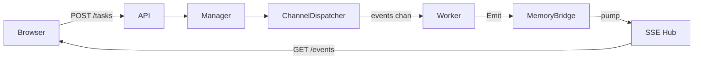
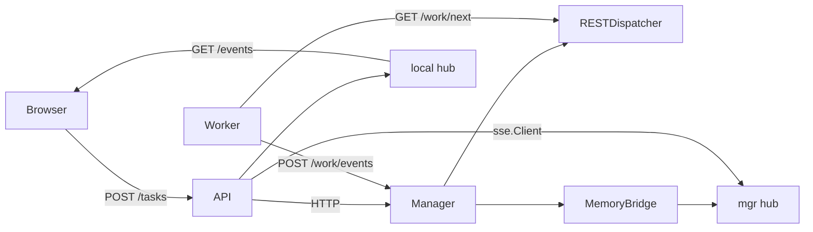
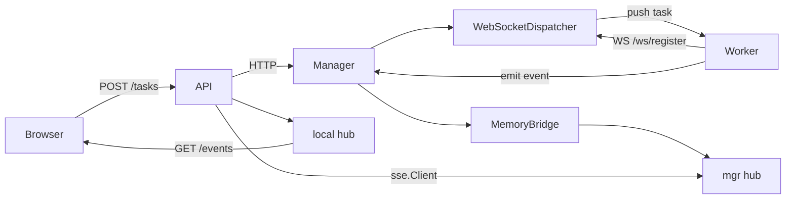
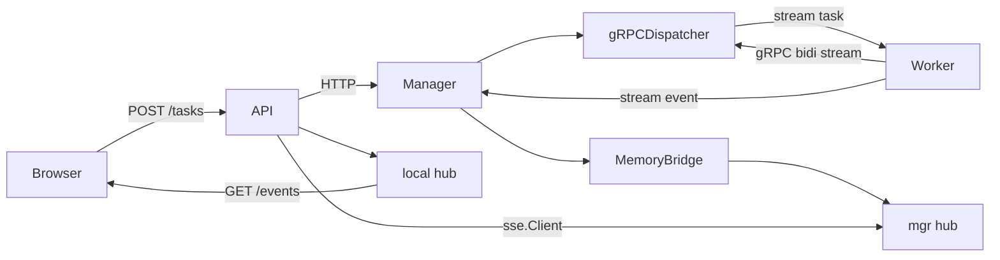
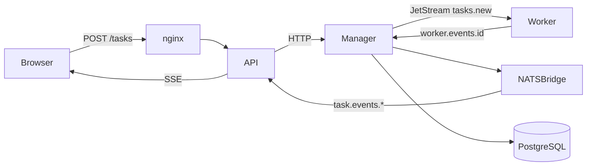
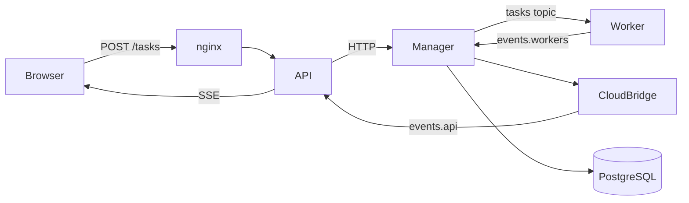

# Architecture

## Overview

Six patterns demonstrating different work distribution topologies, all sharing the same HTTP API surface and HTMX frontend.

## Shared Interfaces

| Interface | Methods | Role |
|-----------|---------|------|
| `contracts.TaskManager` | Submit/Get/List | API → Manager |
| `contracts.TaskDispatcher` | Start/Dispatch/ReceiveEvent | Manager-side transport (⚠ variation point) |
| `contracts.TaskConsumer` | Connect/Receive/Emit | Worker-side transport (⚠ variation point) |
| `events.TaskEventBridge` | Publish/Subscribe | Event streaming |
| `store.TaskStore` | Create/Get/List/SetStatus | Persistence |

- `shared/client.RemoteTaskManager`: proxies Submit/Get/List over HTTP (P2–P6 APIs)
- Sentinel errors: `ErrDispatchFull` → 429, `ErrNoWorkers` → 503
- Manager republishes worker events to `TaskEventBridge` before SSE reaches browser

## Design Invariants

- **Manager republishes to event bus after worker event processing** — ⚠ skipping this breaks P5/P6 consistency (SSE arrives before DB write).
- **API never accesses store directly** — ⚠ breaks P2–P6 where store is manager-local; use `TaskManager.Get/List` instead.
- **`WaitForWorker` waits for probe task completion (not just accept)** — ⚠ for P3/P4, worker must be idle before test suite starts.

## Process Topology

| Pattern | API | Manager | Worker | Transport |
|---------|-----|---------|--------|-----------|
| P1 | single process | same | goroutines | in-process channels |
| P2 | :8080 | :8081 | separate process | REST polling |
| P3 | :8080 | :8081 | separate process | WebSocket push |
| P4 | :8080 | :8081 | separate process | gRPC bidirectional stream |
| P5 | :8080 (×3) | :8081 (×1) | separate process (×3) | NATS JetStream |
| P6 | :8080 (×3) | :8081 (×1) | separate process (×3) | gocloud PubSub (JetStream) |

## Layering

**API** (`shared/api`): HTTP routes, unchanged across patterns.
**Manager** (`shared/manager`): task lifecycle, deadline loop, event routing.
**Transport** (per-pattern): TaskDispatcher + TaskConsumer implementations.

## Pattern 1: Goroutine Pool (single process)

Single-process: ChannelDispatcher/Consumer share in-process event channel. See [details/backend-patterns.md](./details/backend-patterns.md) for setup.

## Pattern 2: REST Polling (separate processes)

Workers poll manager (GET /work/next). API proxies over HTTP via RemoteTaskManager. See [details/backend-patterns.md](./details/backend-patterns.md).

## Pattern 3: WebSocket Hub (separate processes)

Manager pushes tasks to workers over WebSocket; round-robin dispatch. See [details/backend-patterns.md](./details/backend-patterns.md).

## Pattern 4: gRPC Bidirectional Streaming (separate processes)

Workers and manager maintain bidirectional gRPC streams for task/event exchange. See [details/backend-patterns.md](./details/backend-patterns.md).

## Pattern 5: Queue-and-Store (horizontally scaled)

Horizontally scaled: API replicas thin (RemoteTaskManager proxies), Manager/NATS/Postgres are single point. See [details/backend-patterns.md](./details/backend-patterns.md).

## Pattern 6: Cloud-Agnostic PubSub (gocloud abstraction)

Broker-agnostic: same code for NATS/Kafka/AWS via gocloud abstraction. Select via `BROKER` env. See [details/backend-patterns.md](./details/backend-patterns.md).
