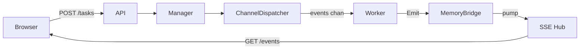
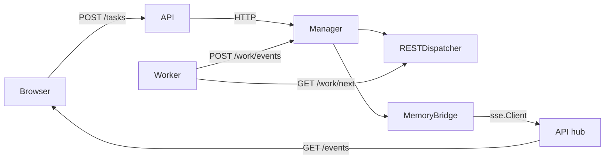
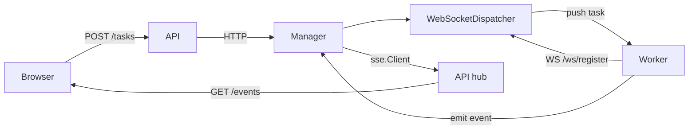
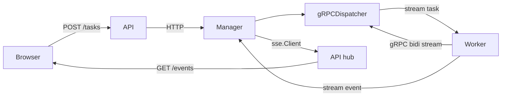
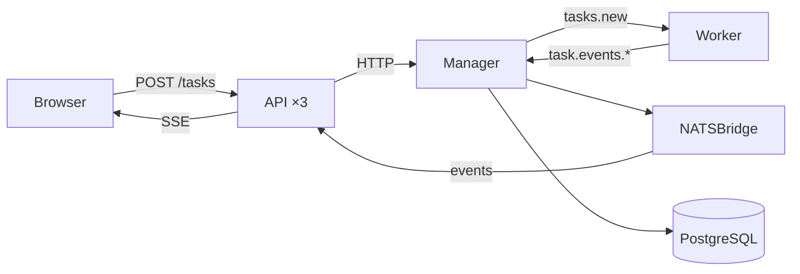
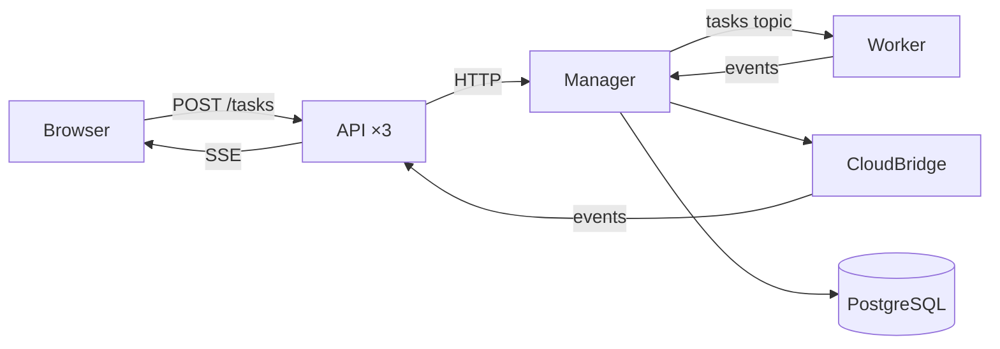
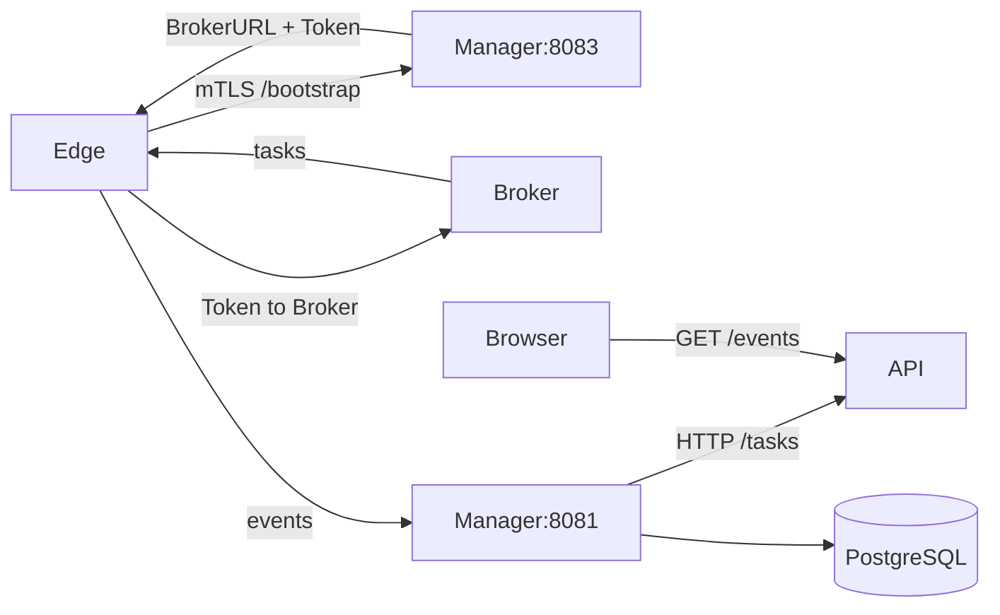

<!-- Load when: Understanding pattern-specific data flows or transport mechanics -->

# Data Flow Diagrams

## P1: Goroutine Pool

## P2: REST Polling

## P3: WebSocket Hub

## P4: gRPC Bidirectional

## P5: NATS + PostgreSQL

## P6: Cloud PubSub (gocloud)

## P7: Bootstrap-Driven Edge Worker

